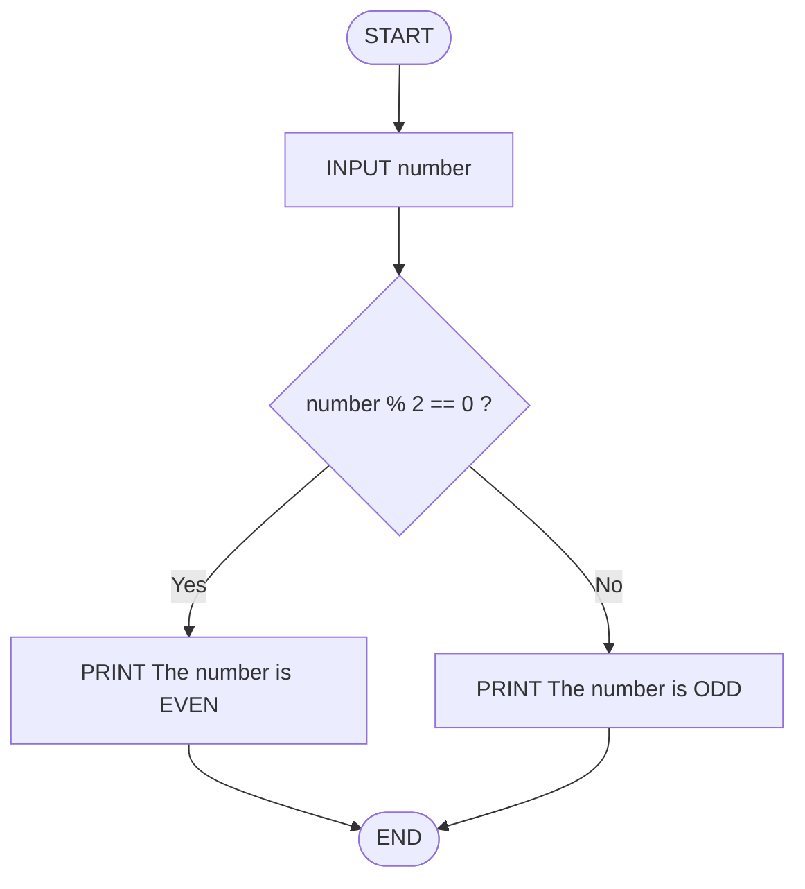

```mermaid
flowchart TD
    A([START]) --> B[INPUT number]
    B --> C{number % 2 == 0 ?}
    C --> |Yes| D[PRINT The number is EVEN]
    C --> |No| E[PRINT The number is ODD]
    D --> F([END])
    E --> F([END])
```