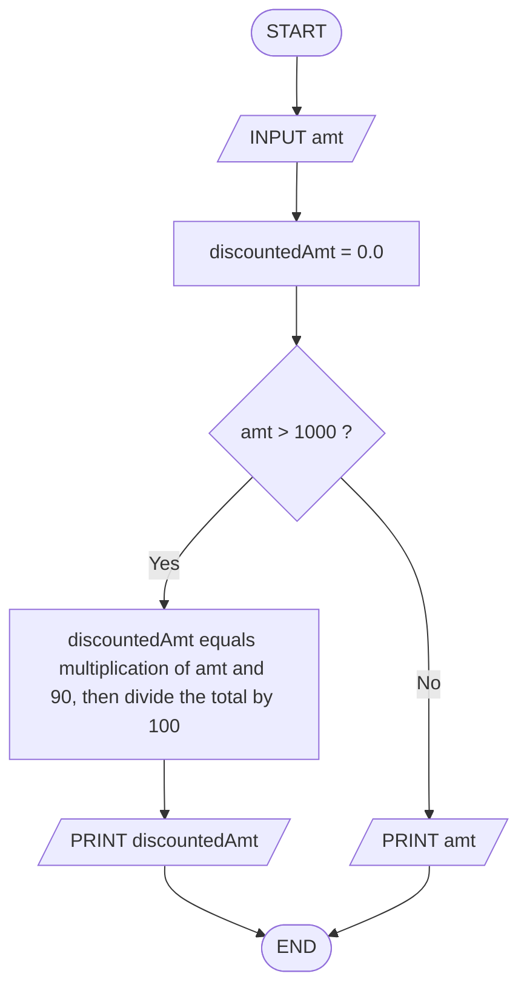

```mermaid
flowchart TD
    A([START]) --> B[/INPUT amt/]
    B --> C[discountedAmt = 0.0]
    C --> D{amt > 1000 ?}
    D --> |Yes| E[discountedAmt equals multiplication of amt and 90, then divide the total by 100]
    E --> F[/PRINT discountedAmt/]
    D --> |No| G[/PRINT amt/]
    F --> H([END])
    G --> H([END])
```