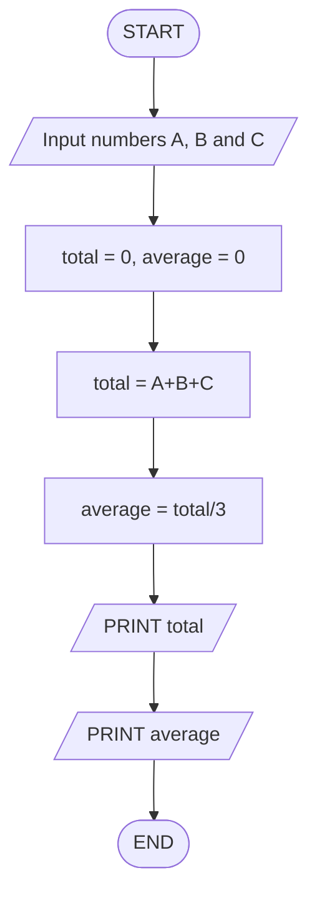

```mermaid
flowchart
    A([START]) --> B[/Input numbers A, B and C/]
    B --> C[total = 0, average = 0]
    C --> D[total = A+B+C]
    D --> E[average = total/3]
    E --> F[/PRINT total/]
    F --> G[/PRINT average/]
    G --> H([END])
```