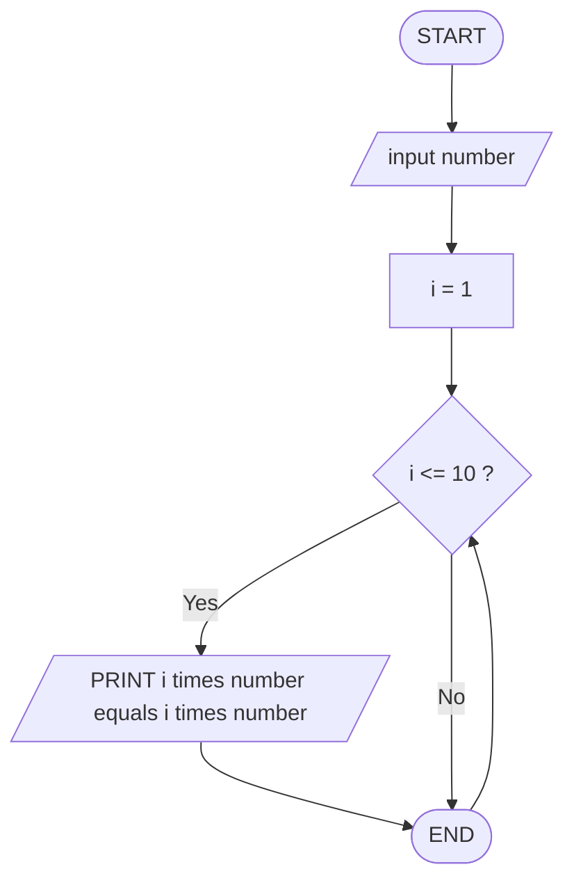

```mermaid
flowchart TD
    A([START]) --> B[/input number/]
    B --> C[i = 1]
    C --> D{i <= 10 ?}
    D --> |Yes| E[/PRINT i times number equals i times number/]
    E --> F[i = i+1]
    F --> D
    D --> |No| F([END])
```