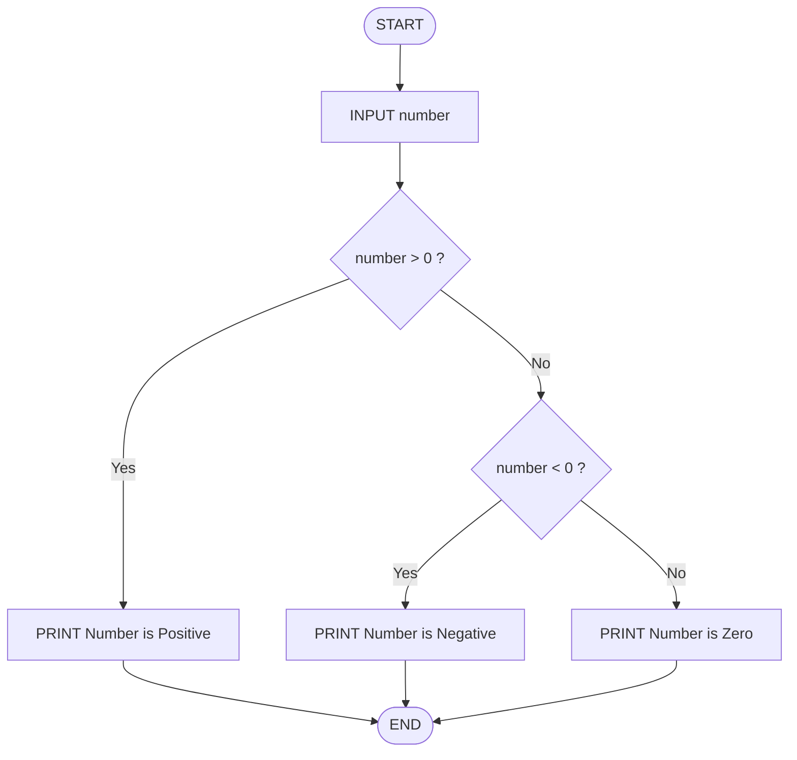

```mermaid
flowchart TD
    A([START]) --> B[INPUT number]
    B --> C{number > 0 ?}
    C --> |Yes| D[PRINT Number is Positive]
    C --> |No| E{number < 0 ?}
    E --> |Yes| F[PRINT Number is Negative]
    E --> |No| G[PRINT Number is Zero]
    D --> H([END])
    F --> H([END])
    G --> H([END])
```