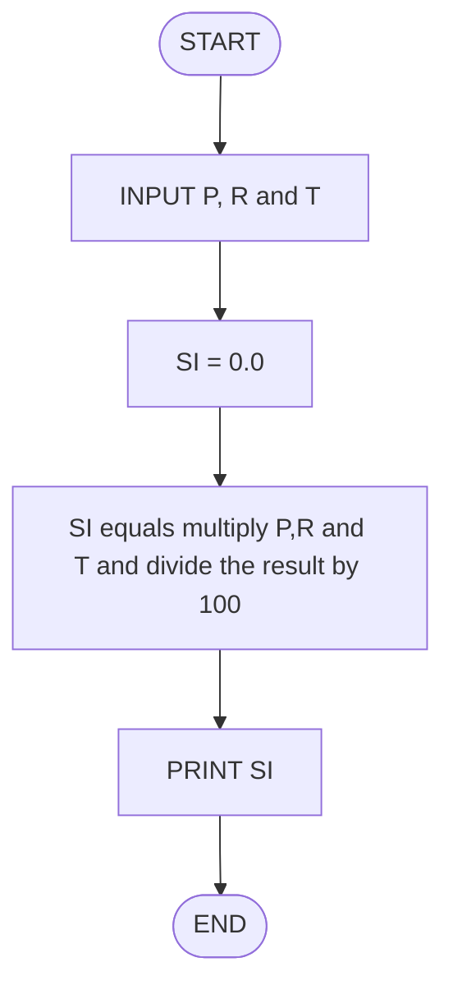

```mermaid
flowchart TD
    A([START]) --> B[INPUT P, R and T]
    B --> C[SI = 0.0]
    C --> D[SI equals multiply P,R and T and divide the result by 100]
    D --> E[PRINT SI]
    E --> F([END])
```