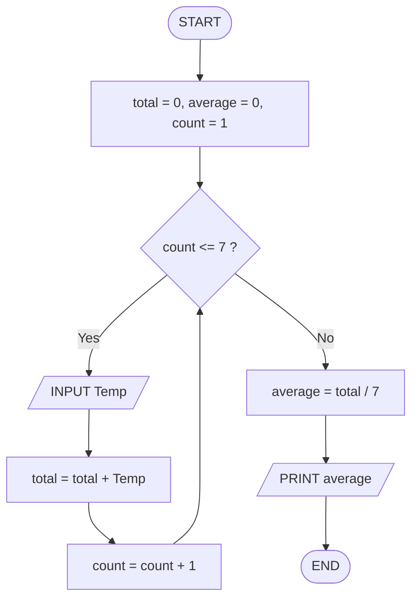

```mermaid
flowchart TD
    A([START]) --> B[total = 0, average = 0, count = 1]
    B --> C{count <= 7 ?}
    C --> |Yes| D[/INPUT Temp/]
    D --> E[total = total + Temp]
    E --> F[count = count + 1]
    F --> C
    C --> |No| G[average = total / 7]
    G --> H[/PRINT average/]
    H --> I([END])
```