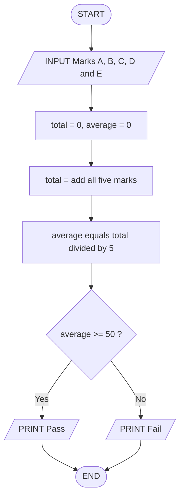

```mermaid
flowchart TD
    A([START]) --> B[/INPUT Marks A, B, C, D and E/]
    B --> C[total = 0, average = 0]
    C --> D[total = add all five marks]
    D --> E[average equals total divided by 5]
    E --> F{average >= 50 ?}
    F --> |Yes| G[/PRINT Pass/]
    F --> |No| H[/PRINT Fail/]
    G --> I([END])
    H --> I([END])
```