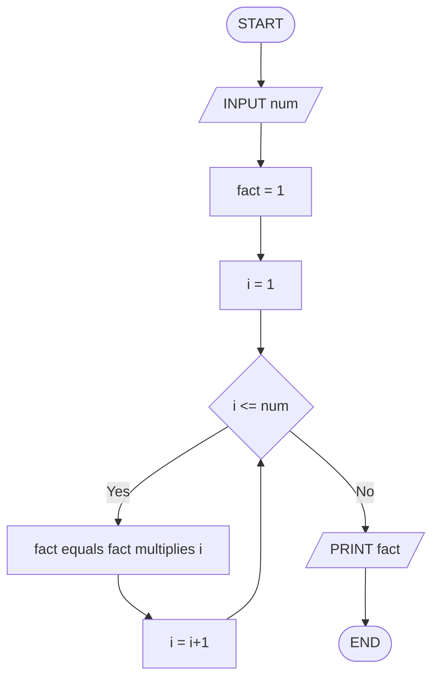

```mermaid
flowchart TD
    A([START]) --> B[/INPUT num/]
    B --> C[fact = 1]
    C --> D[i = 1]
    D --> E{i <= num}
    E --> |Yes| F[fact equals fact multiplies i]
    F --> G[i = i+1]
    G --> E
    E --> |No| H[/PRINT fact/]
    H --> I([END])
```