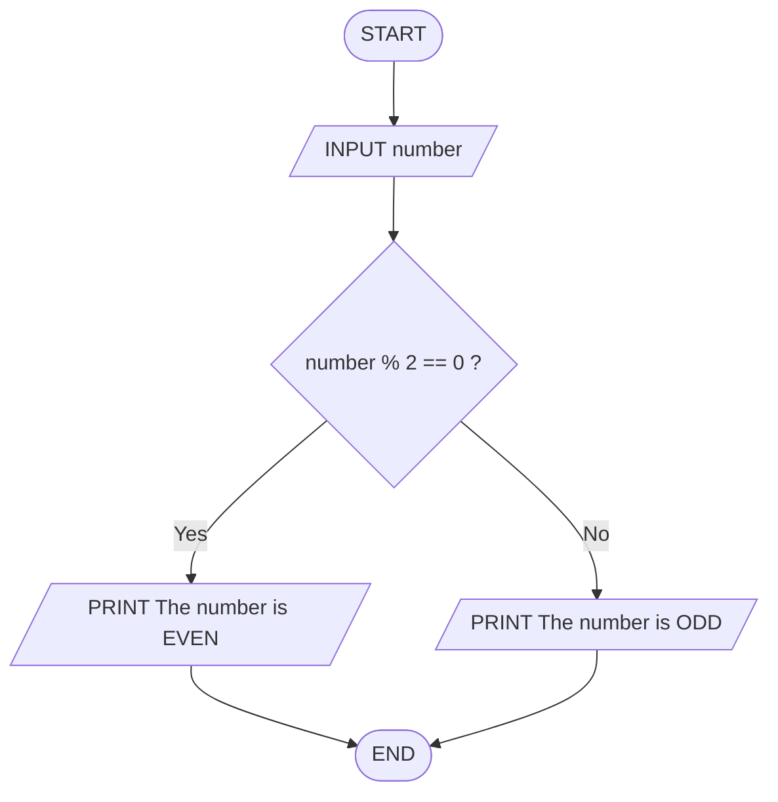
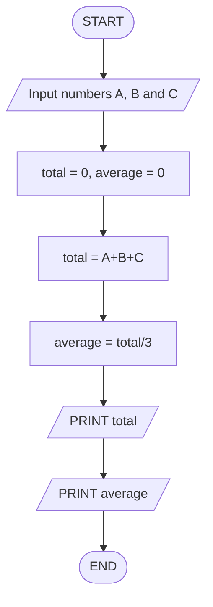
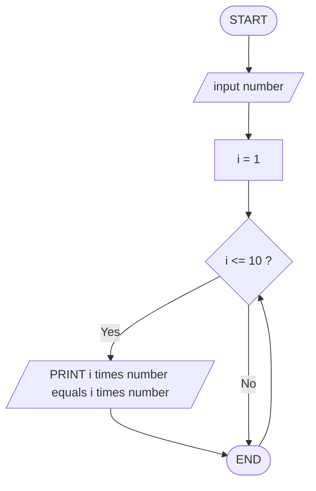
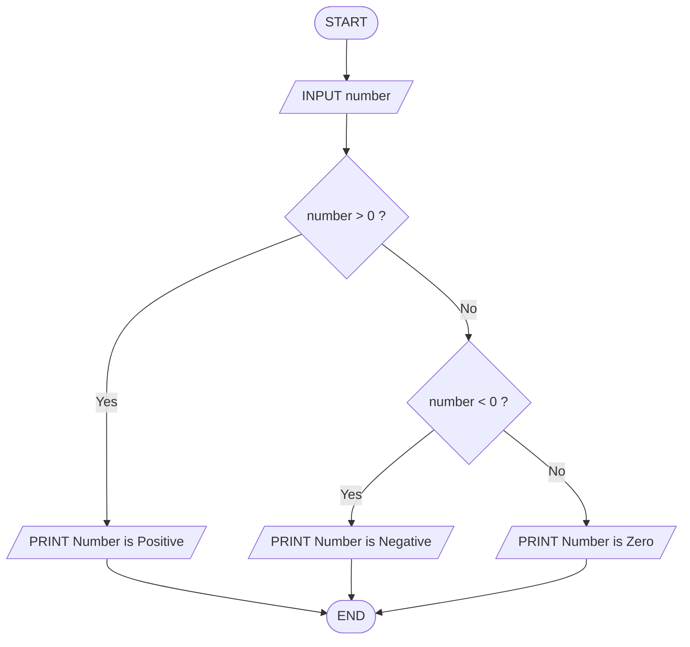
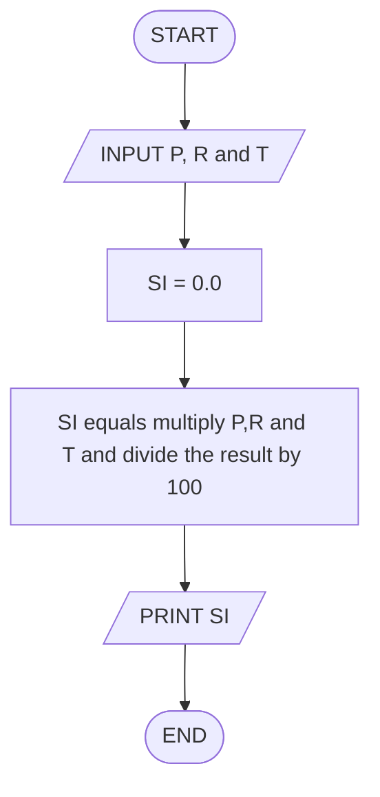
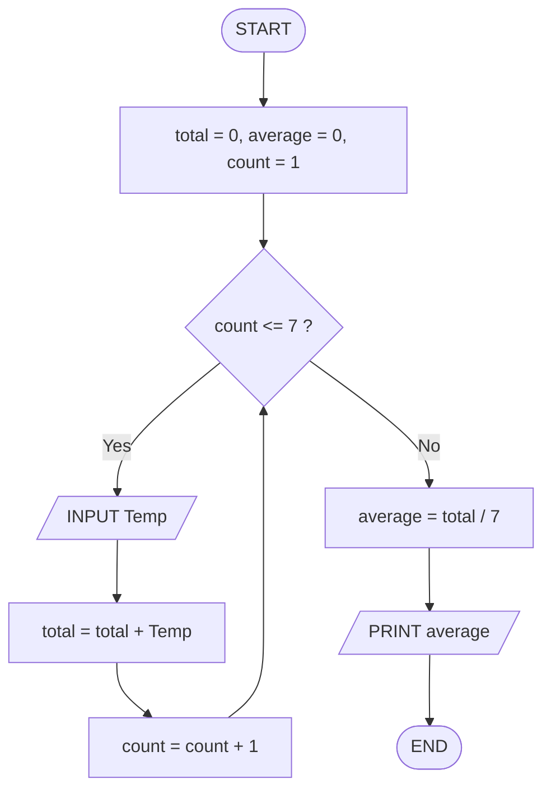
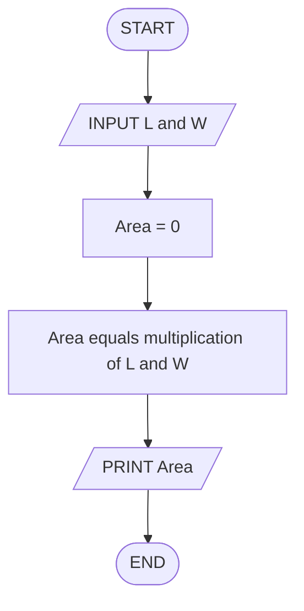
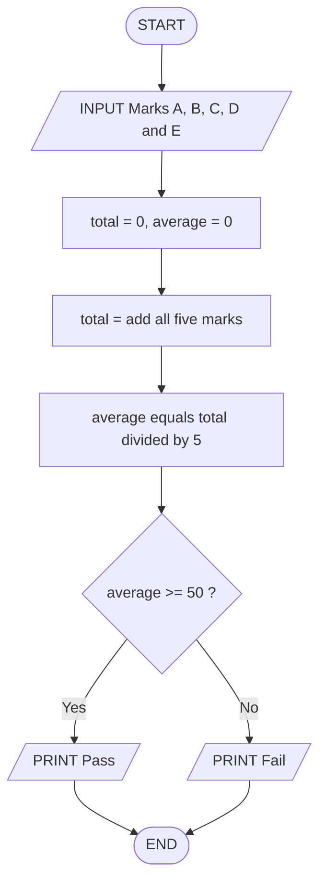
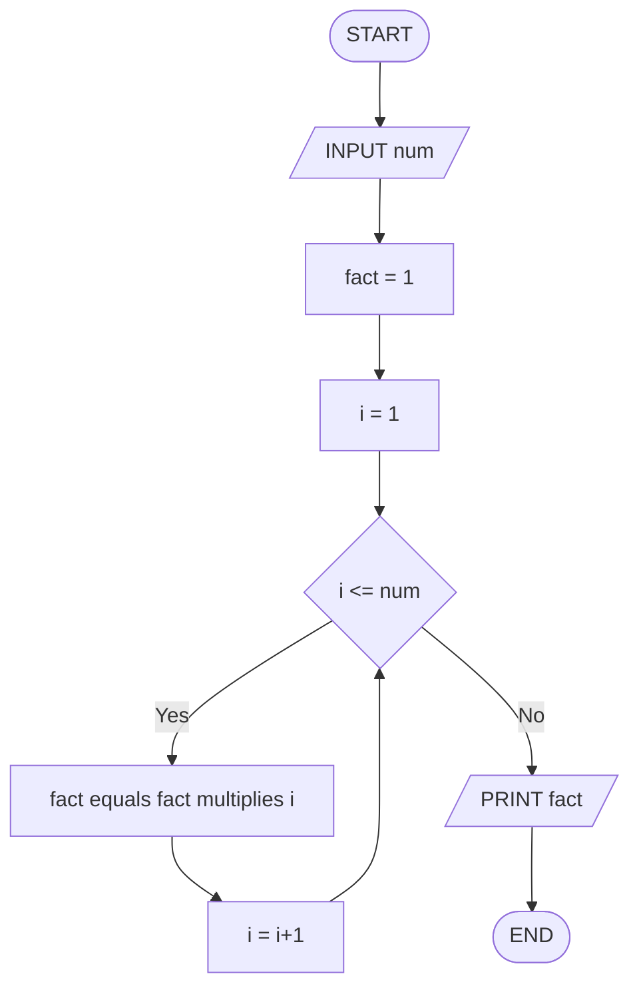
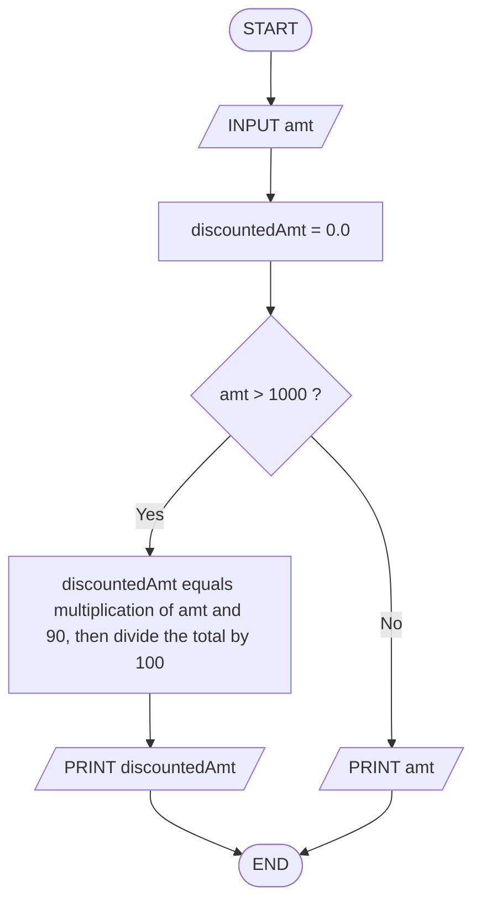

# 1. Check Even or Odd Number

Design an algorithm and flowchart that take a number as input and determine whether it is even or odd.

## Pseudocode
```
START
    INPUT number
    IF (number % 2 == 0) THEN
        PRINT The number is EVEN
    ELSE
        PRINT The number is ODD
    ENDIF
END
```

## Flowchart



# 2. Calculate Total and Average Marks

Write the algorithm and draw the flowchart for a program that inputs marks for 3 subjects, calculates the total and average, and displays both.

## Pseudocode
```
START
    INPUT A,B and C
    total = 0, average = 0
    total = A + B + C
    average = total / 3
    PRINT "Total marks is "+total
    PRINT "Average is "+average
END
````

## Flowchart


# 3. Display Multiplication Table

Create an algorithm and flowchart that input a number and display its multiplication table from 1 to 10 using a loop.

## Pseudocode
```
START
    INPUT number
    FOR i = 1 to 10 DO
        PRINT (i+"*"+number+"="+(i*number))
    END FOR
END
```

## Flowchart


# 4. Positive, Negative, or Zero Check

Write the algorithm and flowchart to input a number and display whether it is positive, negative, or zero.

## Pseudocode
```
START
    INPUT number
    IF number > 0 THEN
        PRINT "The number is Positive"
    ELSE IF number < 0 THEN
        PRINT "The number is Negative"
    ELSE
        PRINT "The number is Zero"
    END IF
END
````

## Flowchart


# 5. Simple Interest Calculator

Create an algorithm and flowchart for a program that calculates simple interest using the formula

## Pseudocode
```
START
    INPUT P, R and T
    SI = 0.0
    SI = (P * R * T) / 100
    PRINT "The Simple Interest is "+SI
END
```

## Flowchart


# 6. Average Temperature Calculation

Write the algorithm and draw the flowchart for a program that takes the temperature of 7 days, finds the average temperature, and displays it.

## Pseudocode
```
START
    total = 0, average = 0
    REPEAT 7 TIMES
        INPUT temp
        total = total + temp
    ENDREPEAT
    average = total / 7
    PRINT "Average Temperature is ", average
END
````

## Flowchart


# 7. Calculate Area of a Rectangle

Create an algorithm and flowchart to input length and width, calculate the area (Area = Length × Width), and display the result.

## Pseudocode
```
START
    INPUT L and W
    Area = 0
    Area = L * W
    PRINT "Area of Rectangular is "+Area
END
````

## Flowchart


# 8. Determine Pass or Fail

Write the algorithm and draw the flowchart for a program that takes a student's average marks and displays "Pass" if average ≥ 50, otherwise "Fail".

## Pseudocode
```
START
    INPUT marks A, B, C, D and E
    total = 0, average = 0
    total = A+B+C+D+E
    average = total / 5
    IF average >= 50 THEN
        PRINT Pass
    ELSE
        PRINT Fail
    END IF
END
````

## Flowchart


# 9. Calculate Factorial of a Number

Write the algorithm and draw the flowchart that input a number and calculate its factorial using a loop.

## Pseudocode
```
START
    INPUT num
    fact = 1
    FOR i = 1 TO num DO
        fact = fact * i 
    END FOR
    PRINT "Factorial of a Number is +fact"
END
````

## Flowchart



# 10. Calculate Discount on Purchase

Write the algorithm and draw the flowchart for a program that inputs the purchase amount and gives a 10% discount if the amount is greater than 1000.

## Pseudocode
```
START
    INPUT amt
    discountedAmt = 0.0
    IF (amt > 1000) THEN
        discountedAmt = (amt * 90) / 100
        PRINT "Amount to be paid after the discound is "+discountedAmt
    ELSE
        PRINT "Amount to be paid is "+amt
    END IF
END
````

## Flowchart
